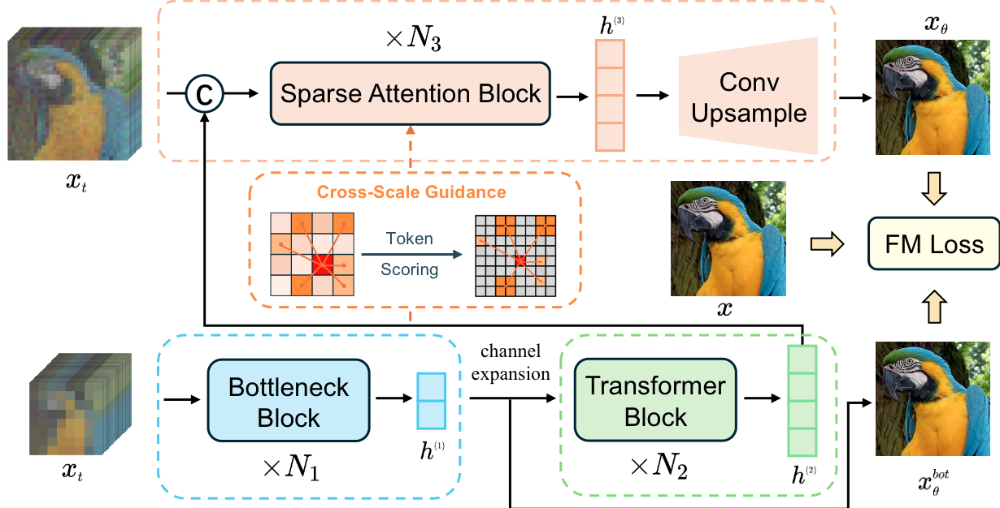

<h2 align="center">Advanced Pixel Diffusion Model with Guided Sparse Global Refinement</h2>

  Weiyi You &middot;
  Jinhua Zhang &middot;
  Xingyu Zhou &middot;
  Wei Long &middot;
  Junyu Lou &middot;
  <a href="https://scholar.google.com/citations?user=-kSTt40AAAAJ">Shuhang Gu</a>†

  University of Electronic Science and Technology of China

  † Corresponding author

  
  
  

## Overview

PixSGR explores a pixel diffusion architecture that combines bottleneck and
Transformer blocks with cross-scale guidance and sparse attention for global
refinement.

## Framework

  

  <em>PixSGR couples cross-scale token scoring with guided sparse attention and convolutional upsampling.</em>

## Contact

For questions or collaborations, contact
[Weiyi You](mailto:weiyiyou.ywy@gmail.com).

If you find this work useful, please consider starring the repository.
